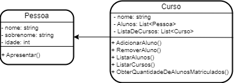
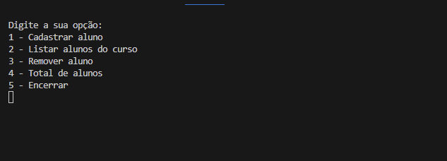

## Projeto Curso Idiomas

Para este projeto, o curso de idiomas oferece cursos de francês e inglês para alunos de diferentes níveis de conhecimento. O curso está em constante expansão e precisa de um sistema que gerencie o cadastro dos alunos em cada curso.

## Proposta

Para solucionar este problema, desenvolvi um sistema de gerenciamento de alunos que permita a inclusão de novos alunos em cada curso, evitando duplicidade de registros. O sistema também deve permitir a visualização dos alunos matriculados em cada curso e a remoção de alunos de um determinado curso. A estrutura das classes Pessoa para aluno e Curso para cursos segue o seguinte diagrama:

## A classe Pessoa contém três variáveis, sendo elas:

**nome**: Tipo texto. É o primeiro nome do aluno.

**sobrenome**: Tipo texto. É o sobrenome do aluno.

**idade**: Tipo inteiro. É idade do aluno.

 

## A classe Pessoa contém um método, sendo ele:

**Apresentar**: Onde o aluno fala seu nome completo e idade.

 

## A classe Curso contém três variáveis, sendo elas:

**nome**: Tipo texto. É o nome do curso.

**Alunos**: Tipo lista. É uma lista dde objetos do tipo 'Pessoa' que contém todos os alunos matriculados no curso.

**ListaDeCursos**: Tipo lista. É uma lista dde objetos do tipo 'Curso' que contém todos os cursos.

 

## A classe Curso contém cinco métodos, sendo eles:

**AdicionarAluno**: Matricula o Aluno no curso indicado.

**RemoverAluno**: Remove o Aluno do curso indicado.

**ListarAlunos**: Lista todos os alunos matriculados no curso selecionado.

**ObterQuantidadeDeAlunosMatriculados**: Retorna um número inteiro do total de alunos matriculados no curso.

## Exemplo

Abaixo pode visualizar todo o funcionamento do código, onde não permite duplicidade na matrícula, e sempre faz a verificação antes da execução de algum comando como remover aluno ou adicionar aluno.

